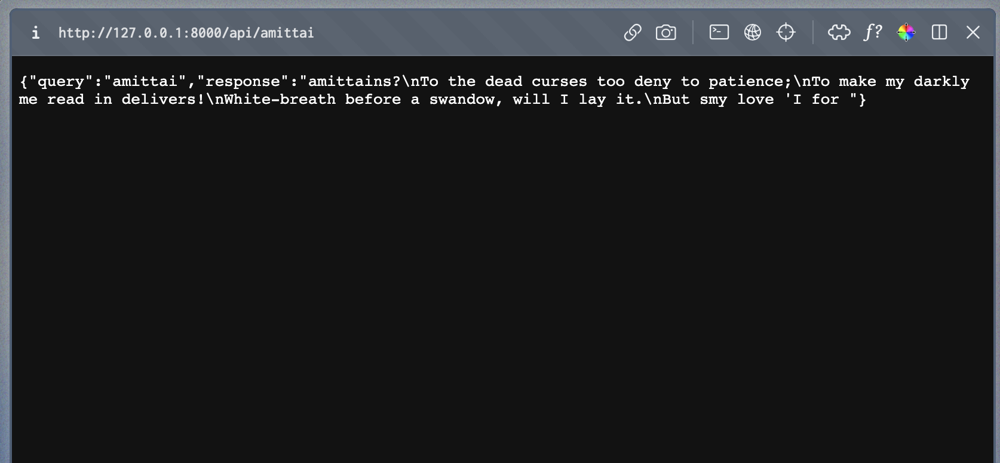
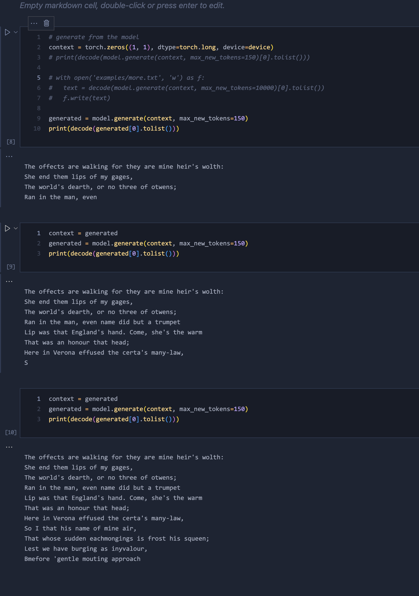

# Generative Pre-trained Transformer Model

## What did you built? 

I followed a tutorial that explains the various components of an AI
model such as GPT and builds such a model by assembling together the
required components using the [`pytorch`](https://pytorch.org/)
deep-learning library.

I trained the model for about 5 hours on a dataset of Shakespeare's works
and saved the final weights.

I then tried out a second tutorial on deploying ML models using FastAPI
to host the model behidn an API that receives query params and
sends back the model's response as JSON.

I haven't gotten down to hosting the api &mdash; but I will soon!  
Presently, clone this repo then start the server in the terminal:

```bash
 uvicorn main:app --reload
```

Include some screenshots.





## Who Did What?

[Amittai](https://amittai.studio)

## What you learned

- Building ML models.
- Deploying ML models.
- A few hazards involved therein.
  > For instance, I attempted deploying to Vercel but apparently something about the model was too big.
  > I'll have to find another solution.

## Authors

TODO: list of authors

## Acknowledgments

1. [Build GPT](https://youtu.be/kCc8FmEb1nY?si=4LlDUknYh9lOyl7m)
2. [Deploy using FastAPI](https://youtu.be/h5wLuVDr0oc?si=vpJD81o03AmjiDGx)

